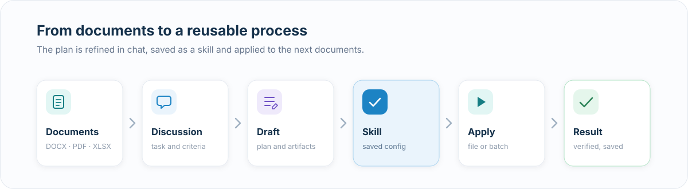
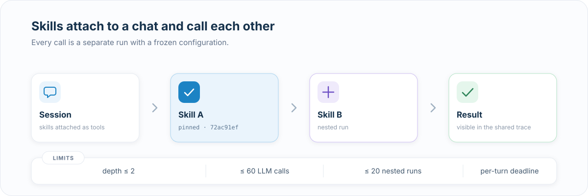
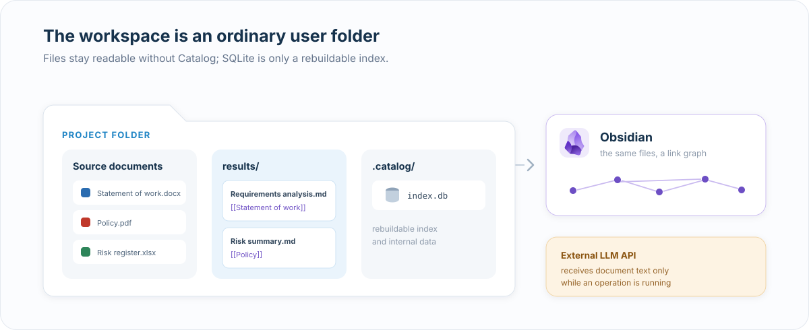
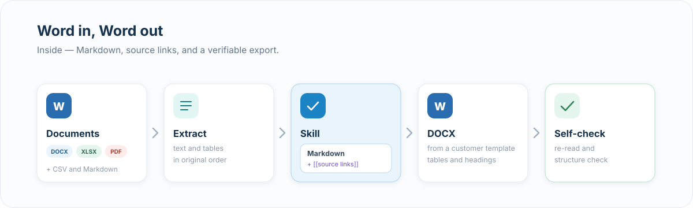

# Catalog

**English** | [Русский](README.md)

[](https://github.com/belchch/catalog/actions/workflows/ci.yml)
[](LICENSE.md)

A local-first app for building reusable document-processing workflows.

You describe a task in chat, refine the plan, and save it as a skill. A skill can be applied to other documents, plugged into new sessions as a tool, or used as a step in a larger process.


## Video demo

[](https://youtu.be/KWdBJNsCvBE)

[Watch the 4-minute product walkthrough](https://youtu.be/KWdBJNsCvBE) — from opening a local workspace to building, checking, and reusing a skill, with Obsidian-compatible results.

[Quick start](#quick-start) · [Run and setup](README-RUN.md) · [Architecture decisions](docs/adr/README.md) · [License](#license)

## How it works



1. Open a folder with documents.
2. Describe the desired result in chat.
3. Catalog builds a plan and the artifacts of the future skill.
4. After you approve it, the skill is saved as a configuration.
5. Apply it to a single document or a set of documents.
6. The result is checked and saved into the working folder.


## Skills

A skill stores the instruction and the execution parameters:

```yaml
kind: agent
name: Contract brief
description: Parties, subject, dates, and amounts from a contract
system_prompt: |
  Read the contract and write a Markdown brief
  with sections “Parties”, “Subject”, “Dates”, “Amounts”.
model: google/gemini-3.5-flash
temperature: 0
allowed_tools:
  - read_document
verify_checks:
  - check: non_empty
  - check: has_section
    params: { heading: "Dates" }
  - check: no_leftover_placeholders
```

Three skill kinds are supported:

- `agent` — the model runs the task with the allowed tools;
- `script` — deterministic Python with no LLM call at runtime;
- `pipeline` — a sequence of steps of different kinds.

A pipeline can include:

- `script` — run code;
- `llm` — call a model;
- `skill` — call another saved skill.

Each LLM step can use its own model, provider, and allowed tools.


## A skill as a session tool

A saved skill can be attached to a session. The model can then call it the same way it calls a system tool.



On a nested call, Catalog:

- uses the frozen skill configuration;
- adds the config hash to the tool description;
- creates a separate nested run;
- shows the call and its result in the trace;
- limits depth, LLM calls, nested runs, and total time.


## System tools

The model currently has three built-in tools:

- `list_documents` — list documents;
- `read_document` — read a document;
- `export_docx` — export one or more documents to DOCX.

A skill only gets the tools listed in its `allowed_tools`. If the config names an unknown tool, execution does not start.


### Extending with plugins

The plugin system is still a direction of work. A plugin is expected to add a related capability:

- model tools;
- result or export checks;
- a new format;
- templates and other resources.

An enabled plugin will define the available set of capabilities, and the skill's `allowed_tools` will define the allowed subset. Third-party plugins will need isolation for executable code.

## Result verification

After a run, the result is checked separately from the main model call.

Built-in checks cover:

- presence and length of the result;
- Markdown structure;
- required sections and fields;
- regular-expression match;
- table correctness;
- leftover placeholders.

You can also add a semantic check through an LLM judge. In the UI and the trace it is shown separately from deterministic checks.


The trace shows skill steps, tool calls, tool responses, model reasoning, check results, and nested runs.


## Data stays in the working folder

A Catalog workspace is an ordinary user folder.

- Source documents stay on the file system.
- Results are saved as Markdown in `results/`.
- `.catalog/index.db` holds a rebuildable index and internal data.
- The result keeps links to the source documents.
- The same folder can be opened in Obsidian.



A references section is appended to the result:

```markdown
## References

- [[Statement of work]]
- [[Policy]]
```

Catalog normalizes wiki-links by file name. Manual Markdown edits in Obsidian do not need a round-trip import.

Files stay local. When you use an external LLM provider, the text needed for the task is sent to the configured model API.


## Documents: Word in, Word out

Catalog reads DOCX, XLSX, PDF, CSV, and Markdown. On upload, DOCX, XLSX, and PDF are validated by file content.

DOCX is parsed with paragraph and table order preserved. You can save the result as Markdown, edit it in Catalog or Obsidian, then export it back to DOCX.

Export supports:

- a customer's Word template;
- merging several documents with section breaks;
- headings, lists, tables, and basic formatting;
- converting wiki-links to plain text;
- keeping the source list;
- re-reading the produced file and checking its structure.




## Corporate use

The architecture leaves room for a closed-loop scenario:

- design skills on a strong model with non-sensitive data;
- move the finished config into an internal environment;
- run it on a local OpenAI-compatible model;
- route the model by document sensitivity class;
- use deterministic checks to control the result.

Skill export/import, sensitivity routing, and pseudonymization are not implemented yet.

## Quick start

You need [uv](https://docs.astral.sh/uv/), Python 3.11+, Node.js, and pnpm (Node and pnpm are only required for a git install — a build hook packages the frontend):

```bash
uv tool install "git+https://github.com/belchch/catalog.git#subdirectory=backend"
catalog
```

On first launch, Catalog will ask for an OpenRouter or z.ai key and a workspace folder.

Full install, provider setup, and a development run are in [`README-RUN.md`](README-RUN.md).

## Architecture decisions

The main decisions are recorded as ADRs:

- [one function-calling loop](docs/adr/0001-agent-loop-execution-engine.md);
- [skill as a frozen config](docs/adr/0002-skill-as-frozen-config.md);
- [build the skill at approval](docs/adr/0004-build-at-approval-lifecycle.md);
- [file system for content, SQLite for the index](docs/adr/0005-storage-split-git-deferred.md);
- [deterministic check registry](docs/adr/0007-verify-deterministic-registry.md);
- [workspace-as-folder](docs/adr/0016-workspace-as-folder.md);
- [pipeline skills](docs/adr/0018-pipeline-skills.md);
- [skill as a session tool](docs/adr/0019-skill-as-session-tool.md);
- [custom checks via an LLM judge](docs/adr/0020-llm-judge-custom-checks.md);
- [nested call limits](docs/adr/0021-skill-tool-budget.md).

Full list: [`docs/adr/README.md`](docs/adr/README.md).

## Status

Working:

- create and apply agent, script, and pipeline skills;
- system and user checks;
- nested skill calls in a session;
- DOCX, XLSX, PDF, CSV, and Markdown on input;
- Markdown and DOCX on output;
- Obsidian-compatible source links;
- OpenRouter and z.ai;
- WebSocket streaming and run traces;
- native install from Git.

Directions of work:

- plugin system;
- local OpenAI-compatible providers;
- moving skills between environments;
- sensitivity routing;
- sandbox for third-party code;
- workspace versioning via Git.

Development context is in [`AGENTS.md`](AGENTS.md).

## License

[PolyForm Noncommercial 1.0.0](LICENSE.md).

The code is open to read, study, and use non-commercially: personal projects, education, research, and non-profit organizations. Commercial use requires a separate license — write to rbelchenko@gmail.com.
