# Catalog

[English](README.en.md) | **Русский**

[](https://github.com/belchch/catalog/actions/workflows/ci.yml)
[](LICENSE.md)

Локальное приложение для создания и повторного использования процессов обработки документов.

Пользователь описывает задачу в чате, уточняет план и сохраняет его как скилл. Скилл можно применять к другим документам, подключать как инструмент в новых сессиях и использовать как шаг более сложного процесса.

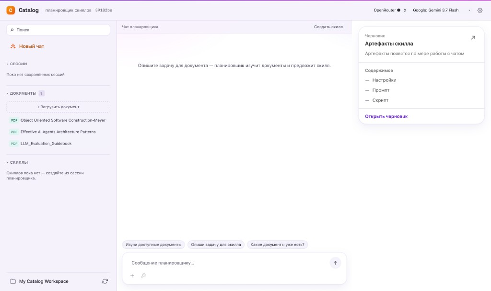

## Видеодемо

[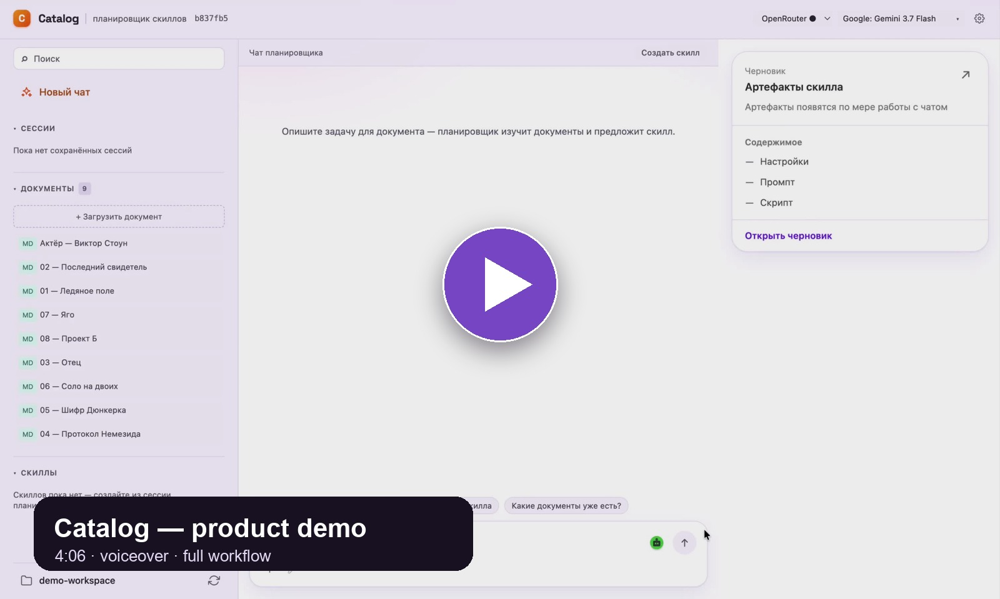](https://youtu.be/pSu7ZdjWJ6I)

[Посмотреть четырёхминутную демонстрацию](https://youtu.be/pSu7ZdjWJ6I) — от открытия локального воркспейса до создания, проверки и повторного использования скилла с результатами, совместимыми с Obsidian.

[Быстрый старт](#быстрый-старт) · [Запуск и настройка](README-RUN.ru.md) · [Архитектурные решения](docs/adr/README.md) · [Лицензия](#лицензия)

## Как это работает

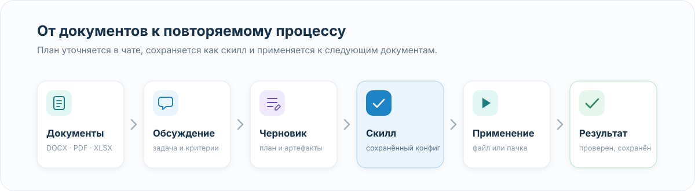

1. Пользователь открывает папку с документами.
2. В чате описывает требуемый результат.
3. Catalog формирует план и артефакты будущего скилла.
4. После подтверждения скилл сохраняется как конфигурация.
5. Его можно применить к одному документу или набору документов.
6. Результат проходит заданные проверки и сохраняется в рабочую папку.

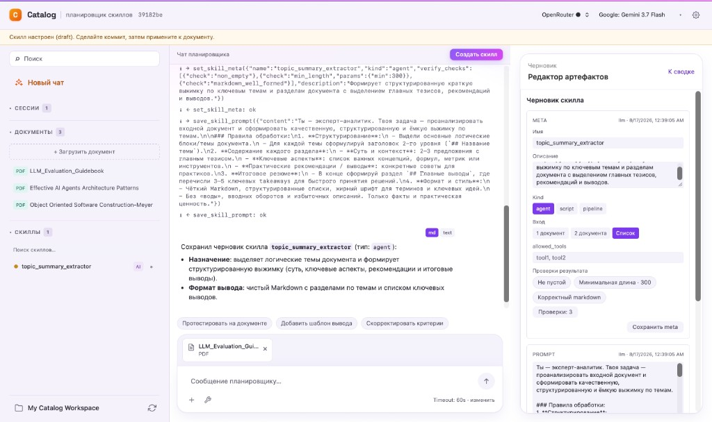

## Скиллы

Скилл хранит инструкцию и параметры выполнения:

```yaml
kind: agent
name: Выжимка договора
description: Стороны, предмет, сроки и суммы из договора
system_prompt: |
  Прочитай договор и составь выжимку в Markdown
  с разделами «Стороны», «Предмет», «Сроки», «Суммы».
model: google/gemini-3.5-flash
temperature: 0
allowed_tools:
  - read_document
verify_checks:
  - check: non_empty
  - check: has_section
    params: { heading: "Сроки" }
  - check: no_leftover_placeholders
```

Поддерживаются три вида скиллов:

- `agent` — задача выполняется моделью с разрешёнными инструментами;
- `script` — детерминированный Python-код без обращения к LLM во время выполнения;
- `pipeline` — последовательность шагов разных типов.

Pipeline может включать шаги:

- `script` — выполнение кода;
- `llm` — обращение к модели;
- `skill` — вызов другого сохранённого скилла.

Для каждого LLM-шага можно отдельно выбрать модель, провайдера и доступные инструменты.

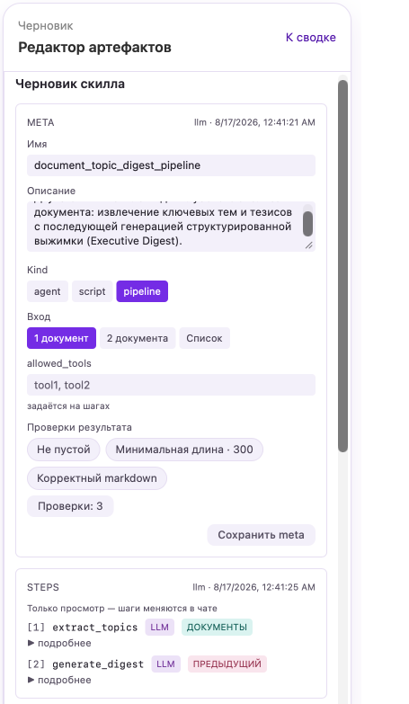

## Скилл как инструмент сессии

Сохранённый скилл можно подключить к сессии. После этого модель может вызвать его так же, как системный инструмент.

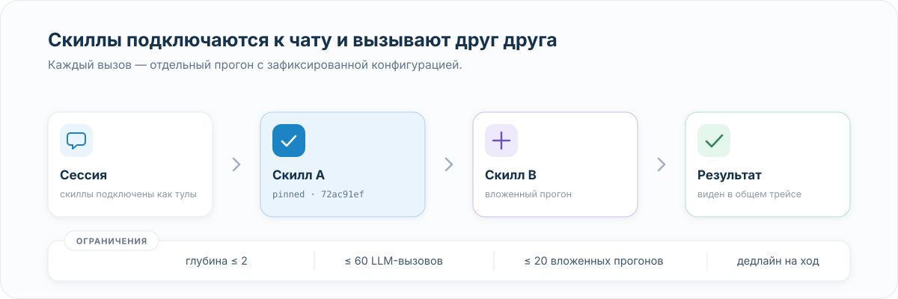

При вложенном вызове Catalog:

- использует зафиксированную конфигурацию скилла;
- добавляет хеш конфигурации в описание инструмента;
- создаёт отдельный вложенный прогон;
- показывает вызов и его результат в трейсе;
- ограничивает глубину, число LLM-вызовов, число вложенных прогонов и общее время.

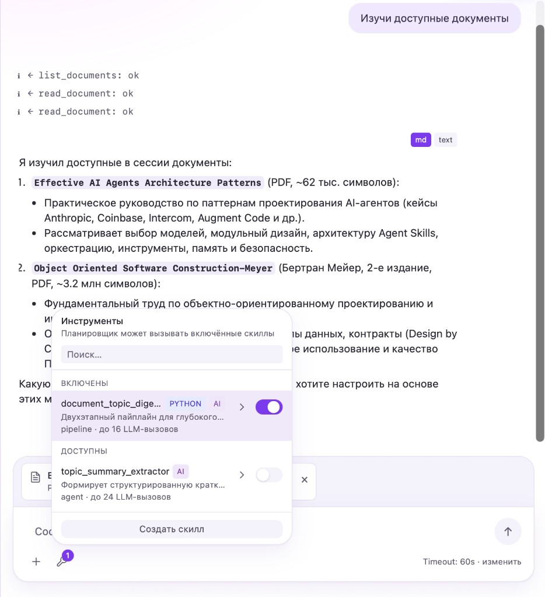

## Системные инструменты

Сейчас модели доступны три базовых инструмента:

- `list_documents` — получить список документов;
- `read_document` — прочитать содержимое документа;
- `export_docx` — выгрузить один или несколько документов в DOCX.

Скилл получает только инструменты из своего `allowed_tools`. Если в конфигурации указан неизвестный инструмент, выполнение не начинается.

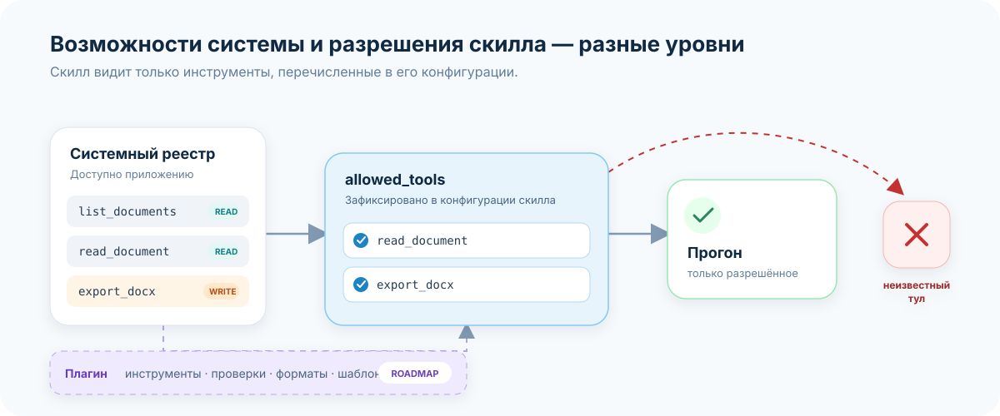

### Расширение через плагины

Система плагинов пока является направлением развития. Предполагается, что плагин сможет добавлять связанную возможность:

- инструменты модели;
- проверки результата или экспорта;
- поддержку нового формата;
- шаблоны и другие ресурсы.

Включённый плагин будет определять доступное множество возможностей, а `allowed_tools` скилла — разрешённое подмножество. Для сторонних плагинов потребуется изоляция исполняемого кода.

## Проверка результата

После выполнения результат проверяется отдельно от основного вызова модели.

Встроенные проверки контролируют:

- наличие и длину результата;
- структуру Markdown;
- обязательные разделы и поля;
- соответствие регулярному выражению;
- корректность таблиц;
- отсутствие незаполненных плейсхолдеров.

Пользователь также может создать смысловую проверку через LLM-судью. В интерфейсе и трейсе она обозначается отдельно от детерминированных проверок.

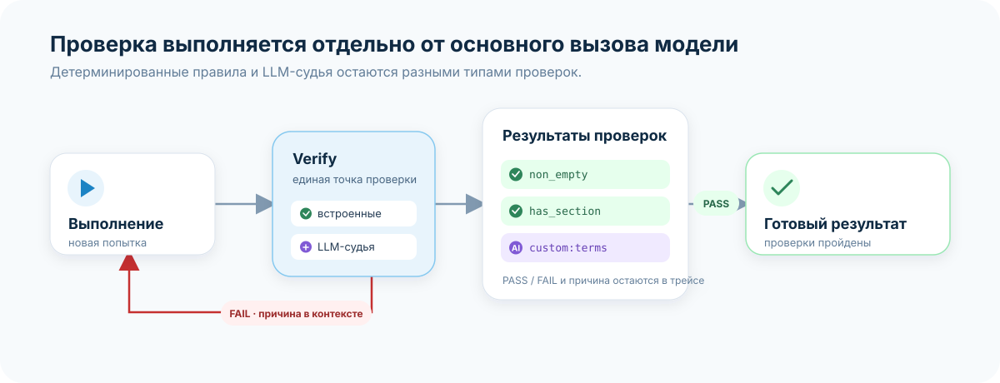

Трейс показывает шаги скилла, вызовы инструментов, ответы инструментов, reasoning модели, результаты проверок и вложенные прогоны.

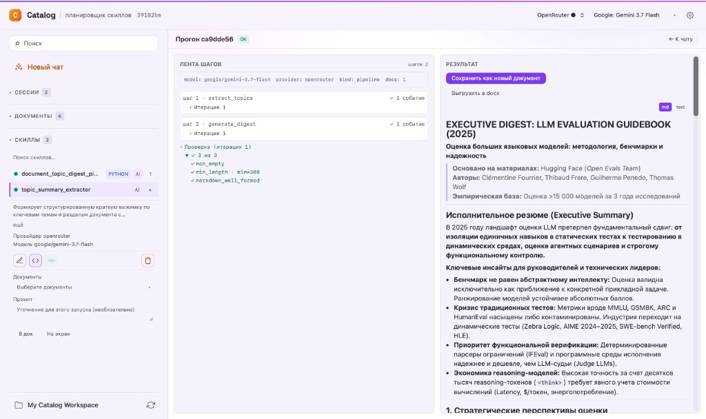

## Данные остаются в рабочей папке

Воркспейс Catalog — обычная папка пользователя.

- Исходные документы остаются на файловой системе.
- Результаты сохраняются как Markdown в `results/`.
- `.catalog/index.db` содержит пересоздаваемый индекс и служебные данные.
- Результат сохраняет ссылки на исходные документы.
- Ту же папку можно открыть в Obsidian.

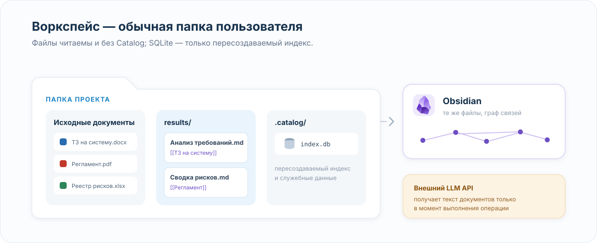

В конец результата добавляется секция со ссылками:

```markdown
## Ссылки

- [[Техническое задание]]
- [[Регламент]]
```

Catalog нормализует wiki-ссылки по именам файлов. Ручные правки Markdown в Obsidian не требуют обратного импорта.

Файлы хранятся локально. При использовании внешнего LLM-провайдера текст, необходимый для выполнения задачи, передаётся в настроенный API модели.

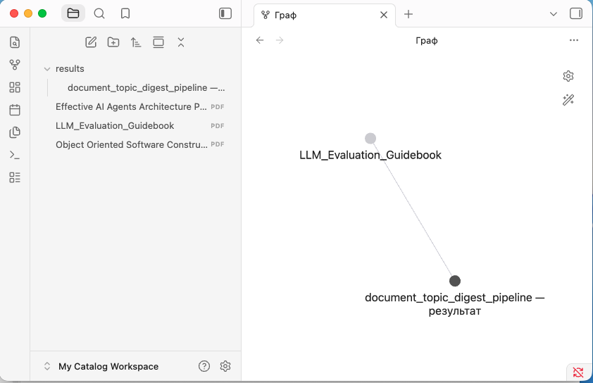

## Документы: Word на входе и на выходе

Catalog читает DOCX, XLSX, PDF, CSV и Markdown. При загрузке DOCX, XLSX и PDF формат проверяется по содержимому файла.

DOCX разбирается с сохранением порядка параграфов и таблиц. Результат можно сохранить в Markdown, отредактировать в Catalog или Obsidian, а затем выгрузить обратно в DOCX.

Экспорт поддерживает:

- шаблон Word заказчика;
- объединение нескольких документов с разрывами разделов;
- заголовки, списки, таблицы и базовое форматирование;
- преобразование wiki-ссылок в обычный текст;
- сохранение списка источников;
- повторное чтение созданного файла и сверку структуры.

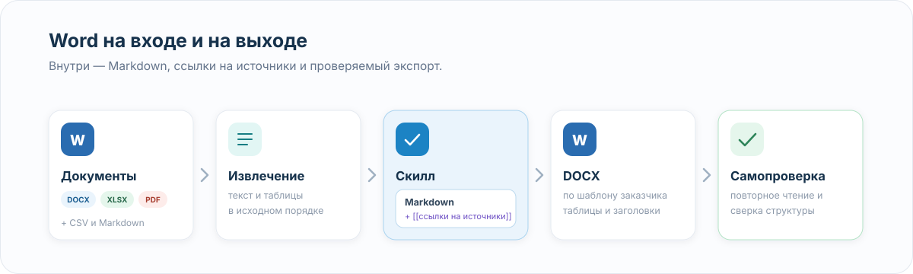

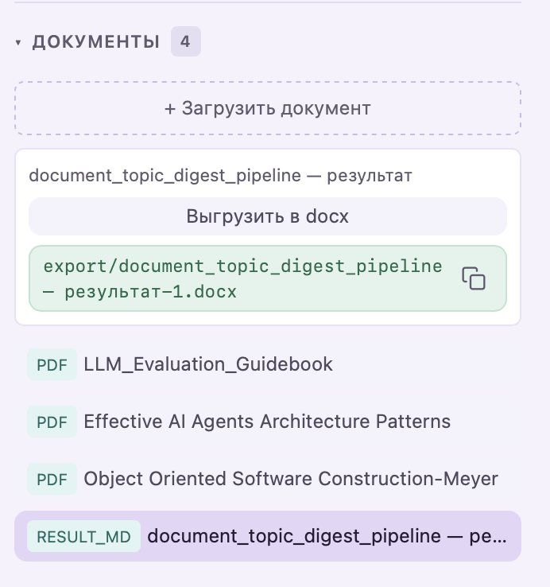

## Корпоративное использование

Архитектура позволяет развивать отдельный сценарий для закрытого контура:

- проектировать скиллы на сильной модели и нечувствительных данных;
- переносить готовую конфигурацию во внутренний контур;
- выполнять её на локальной OpenAI-совместимой модели;
- выбирать маршрут модели по классу чувствительности документа;
- использовать детерминированные проверки для контроля результата.

Экспорт и импорт скиллов, маршрутизация по чувствительности и псевдонимизация пока не реализованы.

## Быстрый старт

Требуются [uv](https://docs.astral.sh/uv/), Python 3.11+, Node.js и pnpm (Node и pnpm нужны только при установке из git — сборочный hook упаковывает фронтенд в пакет):

```bash
uv tool install "git+https://github.com/belchch/catalog.git#subdirectory=backend"
catalog
```

При первом запуске Catalog предложит указать ключ OpenRouter или z.ai и выбрать папку-воркспейс.

Подробная установка, настройка провайдеров и запуск для разработки описаны в [`README-RUN.ru.md`](README-RUN.ru.md).

## Архитектурные решения

Основные решения зафиксированы в ADR:

- [один function-calling loop](docs/adr/0001-agent-loop-execution-engine.md);
- [скилл как замороженный конфиг](docs/adr/0002-skill-as-frozen-config.md);
- [сборка скилла в момент согласия](docs/adr/0004-build-at-approval-lifecycle.md);
- [файловая система для контента и SQLite для индекса](docs/adr/0005-storage-split-git-deferred.md);
- [детерминированный реестр проверок](docs/adr/0007-verify-deterministic-registry.md);
- [workspace-as-folder](docs/adr/0016-workspace-as-folder.md);
- [pipeline-скиллы](docs/adr/0018-pipeline-skills.md);
- [скилл как инструмент сессии](docs/adr/0019-skill-as-session-tool.md);
- [пользовательские проверки через LLM-судью](docs/adr/0020-llm-judge-custom-checks.md);
- [ограничение вложенных вызовов](docs/adr/0021-skill-tool-budget.md).

Полный список: [`docs/adr/README.md`](docs/adr/README.md).

## Статус

Работает:

- создание и применение agent-, script- и pipeline-скиллов;
- системные и пользовательские проверки;
- вложенные вызовы скиллов в сессии;
- DOCX, XLSX, PDF, CSV и Markdown на входе;
- Markdown и DOCX на выходе;
- Obsidian-совместимые ссылки на источники;
- OpenRouter и z.ai;
- WebSocket-стриминг и трейс прогонов;
- нативная установка из Git.

Направления развития:

- система плагинов;
- локальные OpenAI-совместимые провайдеры;
- перенос скиллов между контурами;
- маршрутизация по чувствительности;
- sandbox для стороннего кода;
- версионирование воркспейса через Git.

Контекст для разработки вынесен в [`AGENTS.md`](AGENTS.md).

## Лицензия

[PolyForm Noncommercial 1.0.0](LICENSE.md).

Код открыт для чтения, изучения и некоммерческого использования: личные проекты, обучение, исследования, некоммерческие организации. Коммерческое использование требует отдельной лицензии — напишите на rbelchenko@gmail.com.
