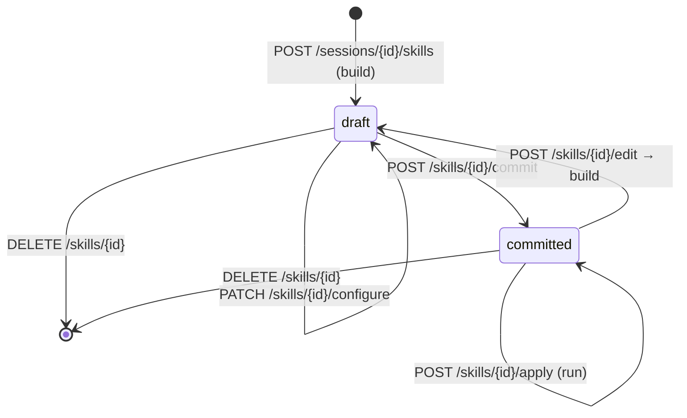

# ADR 0018: Жизненный цикл скилла — draft → configure → commit → apply

- **Date:** 2026-07-24
- **Status:** Accepted
- **Supersedes:** ADR-0004 в части «одним LLM-вызовом собрали → немедленно исполнили»
- **Related:** ADR-0015 (build = упаковка артефактов), ADR-0017 (контракт apply)

## Context

ADR-0004 описывал поток так: пользователь соглашается → один LLM-вызов
собирает `SkillConfig` → скилл **сразу исполняется** на исходном документе
(это и есть реплей-тест) → ревью → коммит. Реализация разошлась с этим
описанием по трём пунктам:

- **build больше не синтезирует** конфиг из чата в основном пути — он
  упаковывает артефакты сессии (ADR-0015);
- **build не исполняет** скилл: между сборкой и первым прогоном появился шаг
  настройки (модель/провайдер/reasoning/arity), а до него применение
  запрещено;
- итерация оформилась в отдельный вход — **edit-сессию** (`session.skill_id`),
  а не в «разморозить конфиг».

Состояния при этом фактически уже существуют в коде (`skill.status`
`draft | committed`), но нигде не записаны как решение.

## Decision

Жизненный цикл скилла — явный конечный автомат по `skill.status`:

1. **build** (`POST /sessions/{id}/skills`) создаёт скилл в статусе `draft`
   и возвращает `SkillPreview`; сессия переводится в `done`. Прогон **не**
   запускается.
2. **configure** (`PATCH /skills/{id}/configure`,
   `backend/app/api/skills.py:910`) — `model` / `provider` / `reasoning` /
   `input_arity` / `name`. Разрешён **только в `draft`**: попытка настроить
   закоммиченный скилл → 409. Так «замороженный конфиг» (ADR-0002) получает
   точное определение: заморозка наступает на commit, а не на build.
3. **rename** (`PATCH /skills/{id}`) — только имя, в любом статусе:
   переименование не меняет поведение скилла.
4. **commit** (`POST /skills/{id}/commit`) — перевод в `committed`. ~~Пока это
   только флаг статуса в SQLite~~ — **закрыто ADR-0022 (2026-07-24):**
   commit материализует конфиг как JSON-файл в `skills/` подключённого
   KB-репозитория и делает точечный git-коммит (только этот файл, не общее
   дерево изменений).
5. **apply** (`POST /skills/{id}/apply`) требует `committed` → иначе 409.
   Черновик нельзя применить: это граница между «ещё собираем» и «пользуемся».
6. **edit** (`POST /skills/{id}/edit`) — создаёт новую сессию с
   `session.skill_id`, засевает `session_artifact` из текущего конфига и
   кладёт человекочитаемый дамп конфига первым сообщением. Build из такой
   сессии **обновляет тот же скилл** (`update_skill`), а закоммиченный
   скилл при этом возвращается в `draft`.

## Consequences

**Плюсы:** пользователь видит preview и выбирает модель/провайдера до первого
платного прогона; статус — однозначный признак «этим можно пользоваться»;
итерация не плодит копии скилла и сохраняет id (а с ним историю прогонов).

**Минусы / риски:** «реплей-тест сразу после сборки» из ADR-0004 больше не
происходит автоматически — проверка воспроизводимости стала ручным шагом
пользователя; edit возвращает скилл в `draft`, поэтому применение недоступно,
пока правка не закоммичена заново — а файл в `skills/` от предыдущего
коммита остаётся на диске непомеченным как устаревший до тех пор (осознанный
выбор ADR-0022, не баг).

## Alternatives considered

- **Оставить поток ADR-0004** (build → сразу apply) — отклонено: прогон
  стартовал на модели по умолчанию, до выбора провайдера, и «съедал» токены
  на заведомо черновом конфиге.
- **Разрешить apply для `draft`** — отклонено: стирает смысл commit и
  делает «замороженность» конфига необеспеченной.
- **Версии скилла вместо возврата в `draft` при edit** — отложено до
  переезда конфигов в ФС+git (ADR-0012): без git версионирование пришлось бы
  изобретать в SQLite, что ADR-0012 явно отверг.
